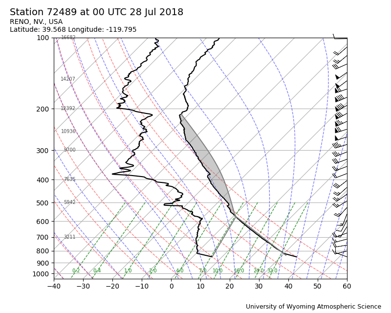
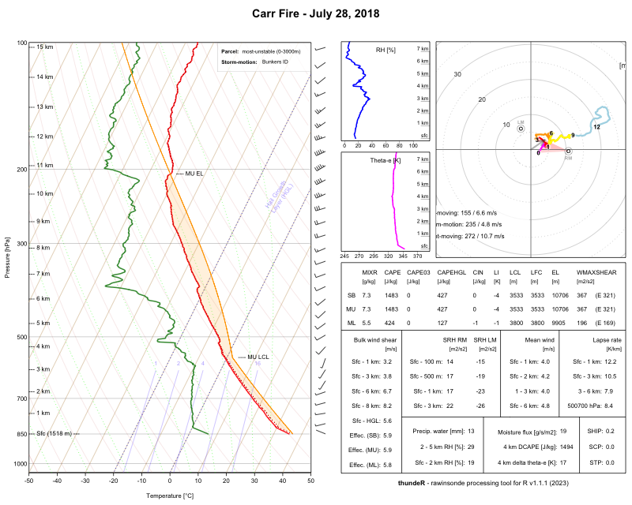
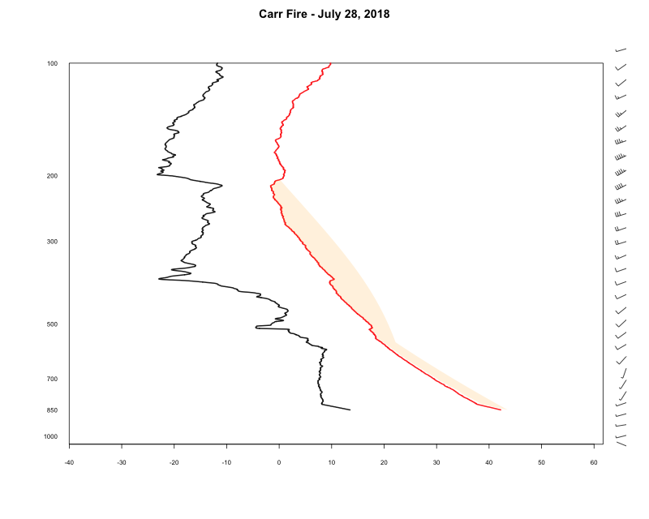

# Simple(ish) skewT-log P plots

This adapts the code from the thunder package to create
the skew-T log P plot without the righ hand panel with many more 
plots and tables.
Also, this allows one to omit the isotherms and other curves typically on the plot.
This makes the remaining elements clearer.


The sounding plot from Wyoming Atmospheric Science group

</img>


The full thunder package plot

</img>

This package

</img>


# Installation

```
install.packages('thunder')
devtools::install_github('duncantl/thunderMin')
```
(assuming the devtools package is installed.)


Alternatively, one can download the zip file of the git repository and 
install from that locally.


# Use

```{r}
data(Carr)
draw(Carr)
```


See the list of data.frames already in the package:
```
data(package = "thunderMin")
```

Get a new sounding dataset with the station id and date:
```
d = getSoundingData(73033, "2026-03-01")
```

# URLs

## Wyoming Atmospheric Science

+ Entry page - https://weather.uwyo.edu/upperair/sounding.shtml

+ Table/PRE - https://weather.uwyo.edu/wsgi/sounding?datetime=2018-07-28%200:00:00&id=72489&src=UNKNOWN&type=TEXT:LIST

+ CSV - https://weather.uwyo.edu/wsgi/sounding?datetime=2025-07-12%2000:00:00&id=72476&type=TEXT:CSV&src=BUFR


##

+ Station information (from 2022) 
  + https://weather.rap.ucar.edu/surface/stations.txt
